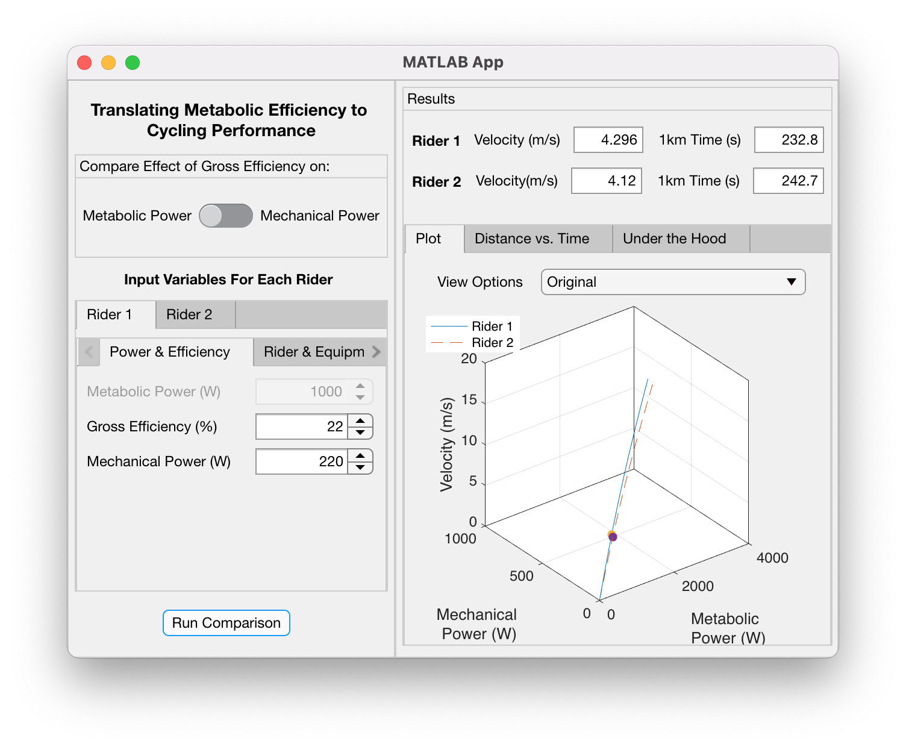

# shiny-cycling-efficiency

| Author(s) | Brief Description | Intended Uses and Known Limitations | Included Material | Updated |
|-|-|-|-|-|
| Ross Wilkinson, Ph.D. | A MATLAB Application that converts the difference in gross efficiency to power output and ground velocity. | Allows the user to compare the effect of gross efficiency on either metabolic power consumption or mechanical power output between two riders under the user's choice of environmental conditions. Can only account for set conditions from start to finish. |  MATLAB application and base functions. | April 19, 2021 |
